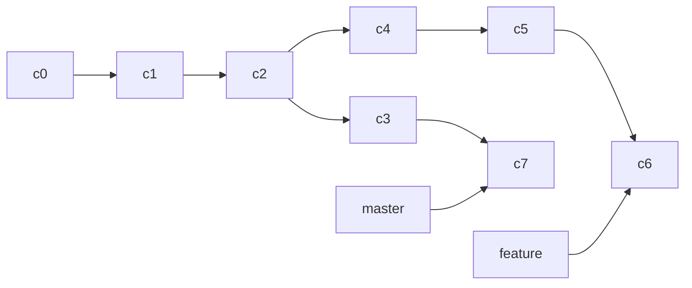

# Git:分布式管理系统

## Git基本概念

工作区：电脑上的目录

暂存区（stage/index):一般存放在 **.git** 目录下的 index 文件（.git/index）中

版本库：工作区的一个隐藏目录 **.git**


## Git工具

```
#Unix与Linux风格的命令行
Git bash

#windows 风格的命令行
Git cmd

#图形界面的Git
Git GUI
```

## Git初始化

### 查看配置信息

```bash
#查看当前文件下的Git配置
$git config --list 

#查看系统Git配置
$git config --system --list

#查看用户(全局）git配置
$git config --global --list
```

### 设置用户信息

```bash
#可以去找磁盘下的gitconfig文件 将用户信息删除
$git config --global user.name "用户名"
$git config --global user.email "邮箱"
```

## Git基本操作


### 创建仓库命令

#### 方式1：创建全新的仓库

```bash
#在当前目录，创建一个git代码库
$git init repository_name
```

执行后，在项目目录多出一个.git目录（隐藏的），关于版本等的所有信息都在其中

#### 方式2：克隆远程目录

这个命令用来克隆一个已存在的 Git 仓库到你的本地计算机上 。`git clone` 会自动帮你创建一个新目录，然后在其中初始化一个 Git 仓库，并从远程仓库复制所有的文件和版本历史。

```bash
#gitee或者github上面克隆一个
$git clone [url]
```

### 提交与修改

#### git add

**git add** 命令可将该文件的修改添加到暂存区

```bash
#添加一个或多个文件到暂存区
git add [file1] [file2] ...

#添加指定目录到暂存区，包括子目录
git add [dir]

#添加当前目录下的所有文件到暂存区
git add .
```

#### git status

**git status** 是一个用于查看 Git 仓库当前状态的命令，会显示以下信息：

- 当前分支的名称。
- 当前分支与远程分支的关系（例如，是否是最新的）。
- 未暂存的修改：显示已修改但尚未使用 `git add` 添加到暂存区的文件列表。
- 未跟踪的文件：显示尚未纳入版本控制的新文件列表。

```bash
#使用 -s参数获得简短的输出结果
git status -s
```

具体来说，`git status -s` 会显示出未暂存的改动以及已暂存的改动的简短状态。输出的格式如下：

- **未暂存的改动**：
  - 新添加的未跟踪文件前面标记为 `??`
  - 已修改但未暂存的文件前面标记为 `M`
  - 已删除但未暂存的文件前面标记为 `D`
- **已暂存的改动**：
  - 新添加到暂存区的文件前面标记为 `A`
  - 修改并添加到暂存区的文件前面标记为 `M`
  - 删除文件并添加到暂存区的操作前面标记为 `D`

**AM** 状态的意思是这个文件在我们将它添加到缓存之后又有改动,其它类似

### 提交日志

```bash
#查看历史提交记录
$git log
#以列表形式查看指定文件的历史修改记录
$git blame <file>
```


### 远程操作

#### git remote

```bash
#列出所有已经配置的远程仓库名称
git remote

#列出所有已经配置的远程仓库名称和url
git remote -v

#添加远程仓库
git remote add remote_name remote_url

#将已经配置的远程仓库重新命名
git remote rename old_name new_name

#从当前仓库中删除远程仓库
git remote remove remote_name

#显示指定远程仓库的详细信息，包括URL和跟踪分支
git remote show remote_name
```


#### git fetch

拉取的分支还需要自己手动merge

```bash
#拉取远程仓库的所有分支更新
git fetch remote_name

#拉去远程仓库的特定分支更新
git fetch remote_name branch_name
```

#### git push

```bash
#|将本地的分支版本上传到远程并合并
git push remote_name local_branch_name : remote_branch_name
```

#### git pull

git pull=git fetch +git merge

```bash
#将远程分支拉取下来与本地分支合并
git pull remote_name branch_name:local_branch_name
```


# 标签

tag是git版本库的一个快照，指向某个commit的指针

```bash
#查看本地所有tag
$git tag

#查看远程所有tag
$git ls-remote

#给当前分支打tag
git tag tagname -m “备注”

#给某个特定的commit版本打标签
git tag tagname commit版本号  -m “备注”

#删除本地某个标签
git tag -d tagname

#删除远程某个标签
git push origin -d tagname

#将本地标签推送到远程
git push origin tagname

#查看某一个标签的提交信息
git show tagname

```


# Git文件操作

```bash
#查看全部文件状态
$git status

#查看指定文件状态
$git status [filename]

#将所有文件提交到暂存区
$git add .

#提交暂存区的内容到本地仓库
$git commit -m "描述信息"
```

## 忽略文件

有时候我们不想将一些文件纳入到版本控制中，会在主目录下建立**“.gitnore”**文件，此文件有以下规则;

1.忽略文件中的空行和以#开头的行

2.可以使用通配符匹配多个文件或目录，常见的通配符有：

- `*`：匹配零个或多个字符。
- `?`：匹配任意一个字符。
- `**`：递归匹配任意子目录。

```
#忽略所有.txt结尾的文件
*.txt
```

3.名称的最前面带有**！**，表示例外规则，将不被忽略

4.名称的最前面带有路径分隔符**/**，表示要忽略的文件在此目录下，而子目录中的文件不忽略

5.名称的最后面带有路径分隔符/,表示忽略整个目录及其内容

```
mydirectory/
```

这样设置会忽略名为`mydirectory`的目录及其所有内容。

**忽略特定文件**：如果你想忽略具有特定名称的文件，但名称后面带有斜杠`/`，你可以在名称前面添加反斜杠`\`进行转义，例如：

```
myfile\.txt
```

这样设置会忽略名为`myfile.txt`的文件，而不是目录。

# 分支管理

## 创建与合并分支

```bash
#给当前head所指向的分支创建分支，这里是因为没有显式的指定起始分支所有默认在当前分支上创建
$git branch branch_name

#不切换到指定的起始点分支而直接在当前分支上创建指定分支的一个新的特性分支
$git checkout -b new_branch_name origin_branch_name

#切换分支
#1
$git checkout branch_name
#2
$git switch branch_name


#创建新分支并将head指向该分支
#1
$git checkout -b branch_name
#2
$git switch -b branch_name

#查看所有分支，当前分支前会标*
$git branch 

#合并分支
$git merge branch_name

#使用--no--ff参数可以禁用fast-forward合并模式
$git merge --no--ff branch_name

#demo将B分支合并到A分支上
$git checkout A
$git merge B

#删除分支
$git branch -d branch_name
```

#### merge和rebase的区别




## Bug分支

假设在master上有bug急需解决，而当前正在另外分支工作，可以使用git stash命令 藏匿工作现场，先去解决bug，再返回该分支继续处理

```bash
#储藏当前工作现场
$git stash

#恢复工作现场
#1 只恢复不删除stash内容
$git stash apply
#删除stash 内容 配合apply使用
$git stash drop
#2恢复工作现场并且删除stash内容
$git stash pop
```

假设从master上衍生出dev分支，master和dev上存在相同的bug，此时正在hello分支上工作，要解决master和dev上的bug

```bash
#先藏匿当前工作现场
$git stash
#切换到master,创造分支解决bug
$git checkout master
$git checkout -b solve_bug
解决bug ing
$git add xx
$git commit 
#此时这里commit有一个版本号

#切换到dev分支解决dev分支上的bug
$git checkout dev

#把bug提交的修改“复制”到当前分支，避免重复劳动
$git cherry-pick <在solve——bug时commit的版本号>

#切换回hello分支恢复现场继续工作
$git checkout hello
$git stash drop

```

代码开发完准备提交，避免在远程仓库发生冲突

```bash
$git stash
$git pull
$git stash pop
#在本地处理冲突
$git commit
$git push
```


## Feature分支

在软件开发中，特性分支（Feature Branch）是一种用于开发单个功能或特性的独立分支。特性分支通常从主分支（如`master`或`main`）分出，并在开发完成后再合并回主分支。使用特性分支的主要优点是能够将不同功能的开发隔离开来，以便更容易管理和跟踪每个功能的开发进度和状态。

```bash
#创建并转到feature分支
$git checkout -b feature_branch_name origin_branch_name

#开发和提交更改
$git add <modified-files>
$git commit -m "Implemented new feature"

#合并到起始分支
$git checkout origin_branch_name 
$git merge feature_branch_name

#开发并提交更改，未merge前 想弃用开发的功能
$git branch -D feature_branch_name #要强行删除，需要使用大写的-D参数

#开发并提交更改，merge后 想弃用开发的功能
git branch -d feature_branch_name  # 删除本地特性分支
git push origin --delete feature_branch_name  # 删除远程特性分支（如果有必要）
```

```bash
开发功能的弃用
#在工作区弃用
$git checkout 文件路径

#在暂存区弃用
$git reset HEAD 文件路径 #变成了在工作区的弃用情况

#在本地仓库弃用，根据reset后面的参数分为三种情况
#1.使用软重置，将 HEAD 指针移动到指定的提交，但保留修改的文件，这种方式会将指定提交及其后续的提交历史都变成未提交的修改，你可以重新提交或者使用其他方式处理这些修改
$git reset --soft <commit>
#2.使用混合重置，将 HEAD 指针移动到指定的提交，并丢弃暂存区的修改，但保留工作区的修改。这种方式会将指定提交及其后续的提交历史变成未暂存的修改，你可以使用 git add 将需要保留的修改添加到暂存区，然后提交。
$git reset --mixed <commit>
#3.使用硬重置，将 HEAD 指针移动到指定的提交，并丢弃暂存区和工作区的所有修改
$git reset --hard <commit>

```

## 多人协作

### 管理远程仓库

```bash
#列出当前配置的远程仓库的简称
$git remote

#查看远程仓库的详细信息，包括其 URL 和 fetch/push 的设置
$git remote -v

#添加远程仓库
$git remote add <remote-name> <remote-url>

#移除远程仓库
$git remote remove <remote_name>

#重命名远程仓库
$git remote <old-name> <new-name>
```

### 推送分支

```bash
#给远程仓库推送分支
$git push <remote_name> <branch_name>
```

不是一定要把本地分支往远程推送，那么，哪些分支需要推送，哪些不需要呢？

- `master`分支是主分支，因此要时刻与远程同步
- `dev`分支是开发分支，团队所有成员都需要在上面工作，所以也需要与远程同步
- bug分支只用于在本地修复bug，就没必要推到远程了，除非老板要看看你每周到底修复了几个bug
- feature分支是否推到远程，取决于你是否和你的小伙伴合作在上面开发

# 使用github

在github上可以Fork开源仓库，自己拥有Fork后的仓库的读写权限，可以推送pull request给官方仓库来贡献代码

```bash
#添加GitLab远程仓库
$git remote add <remote-name> <remote-url>
```

